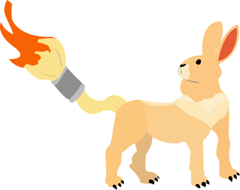

<!-- markdownlint-disable MD033 -->
# Paradôlia

<div align="right">
    <picture></picture>
</div>

> Algo que parece;
>
> É;
>
> Mas, não é;

<picture></picture>
<picture></picture>
<picture></picture>

## 📌 Sobre o Projeto

O **Paradôlia** é uma aplicação web estática voltada ao estímulo da criatividade e combate ao burnout criativo por meio de entropia visual e formas abstratas.

## ✨ Funcionalidades

- 🎨 **Gerador de SVG:** Ferramenta interativa na página inicial para geração de SVGs.
- 💬 **Mensagens Motivacionais:** Dispensador de frases de incentivo à criatividade.
- 📱 **Interface Responsiva:** Design otimizado para celulares, tablets e desktops.
- 📰 **Feed e Fórum:** Espaço de postagens e navegação interativa.

## 🛠️ Tecnologias Utilizadas

- **HTML5:** Estruturação semântica.
- **CSS3:** Estilização responsiva e layouts.

## 🚀 Como Executar o Projeto

### 1° Clone o repositório

```bash
git clone https://github.com/Junior010101/Paradolia.git
```

### 2° Abra a pasta

```bash
cd Paradolia
```

### 3° Abra o arquivo index.html em seu navegador

```text
,----------------------------------.
|  file://.../index.html           |
|----------------------------------|
|  <html>                          |
|    <body>                        |
|      <h1>Paradôlia</h1>          |
|    </body>                       |
|  </html>                         |
`----------------------------------'
                ||
         .------''------.
        /                \
```

---

## Licença do Projeto

Este projeto está licenciado sob a Licença **GNU General Public License v3.0 (GPLv3)**. Veja o arquivo [LICENSE](LICENSE.txt) para mais detalhes.

## Licenças de Terceiros (Third-Party Notices)

### Montserrat Font

Copyright 2024 The Montserrat Project Authors (<https://github.com/JulietaUla/Montserrat.git>)
Licensed under the SIL Open Font License, Version 1.1.

### Inter Font

Copyright 2020 The Inter Project Authors (<https://github.com/rsms/inter>)
Licensed under the SIL Open Font License, Version 1.1.

### Josh's Custom CSS Reset

Copyright 2026 Josh W. Comeau (<https://www.joshwcomeau.com/css/custom-css-reset/>)
Licensed under the MIT License.

### Hero Background Image ("A Quiet Day in Sinnoh")

"A Quiet Day in Sinnoh" por Wynat (<https://lospec.com/gallery/wynat/a-quiet-day-in-sinnoh>).
Disponibilizado na galeria Lospec. Todos os direitos reservados ao seu criador original.

### Ilustrações das Seções Feed, Fórum e Post Body

- **Garota Anime/Manga:** Criada por [andsproject](https://pixabay.com/users/andsproject-28216173/) via [Pixabay](https://pixabay.com/pt/vectors/garota-anime-manga-nuvem-azul-10137698/).
- **Homem Incêndio / Chama:** Criada por [andsproject](https://pixabay.com/users/andsproject-28216173/) via [Pixabay](https://pixabay.com/pt/vectors/homem-inc%C3%AAndio-chama-queimando-7412527/).
- **Winter Cottage Full Moon Night:** Criada por [PixelLabs](https://pixabay.com/users/pixellabs-44988775/) via [Pixabay](https://pixabay.com/illustrations/winter-cottage-full-moon-night-10417187/).
- **Gato Gatinho:** Disponibilizada via [Pixabay](https://pixabay.com/pt/photos/gato-gatinho-bicho-de-estima%C3%A7%C3%A3o-1192026/).
- **Woman Portrait Beauty Face Gothic:** Disponibilizada via [Pixabay](https://pixabay.com/illustrations/woman-portrait-beauty-face-gothic-8754523/).
- **Gameboy Videospiel:** Disponibilizada via [Pixabay](https://pixabay.com/de/photos/gameboy-videospiel-spielen-kind-1143675/).

Disponibilizadas sob a [Licença de Conteúdo do Pixabay](https://pixabay.com/service/license-summary/).

### Background Image ("Collapse of Meanings")

"Collapse of Meanings" por Pepe Mescuzi (<https://lospec.com/gallery/pepe-mescuzi/collapse-of-meanings>).
Disponibilizado na galeria Lospec. Todos os direitos reservados ao seu criador original.

---
**Desenvolvido por [Junior010101](https://github.com/Junior010101)**
